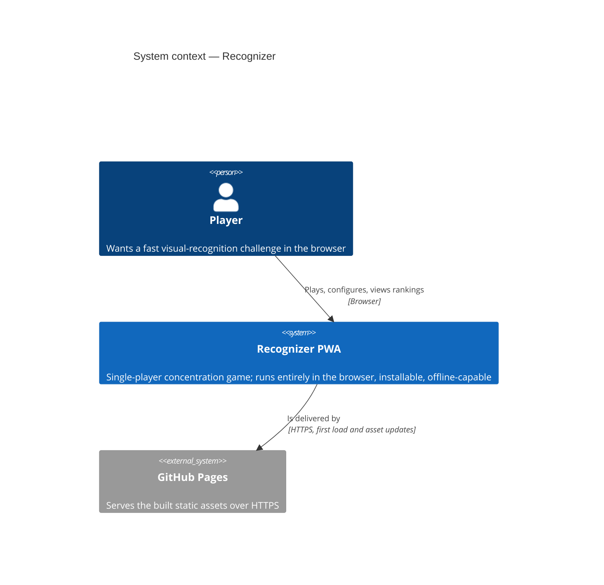
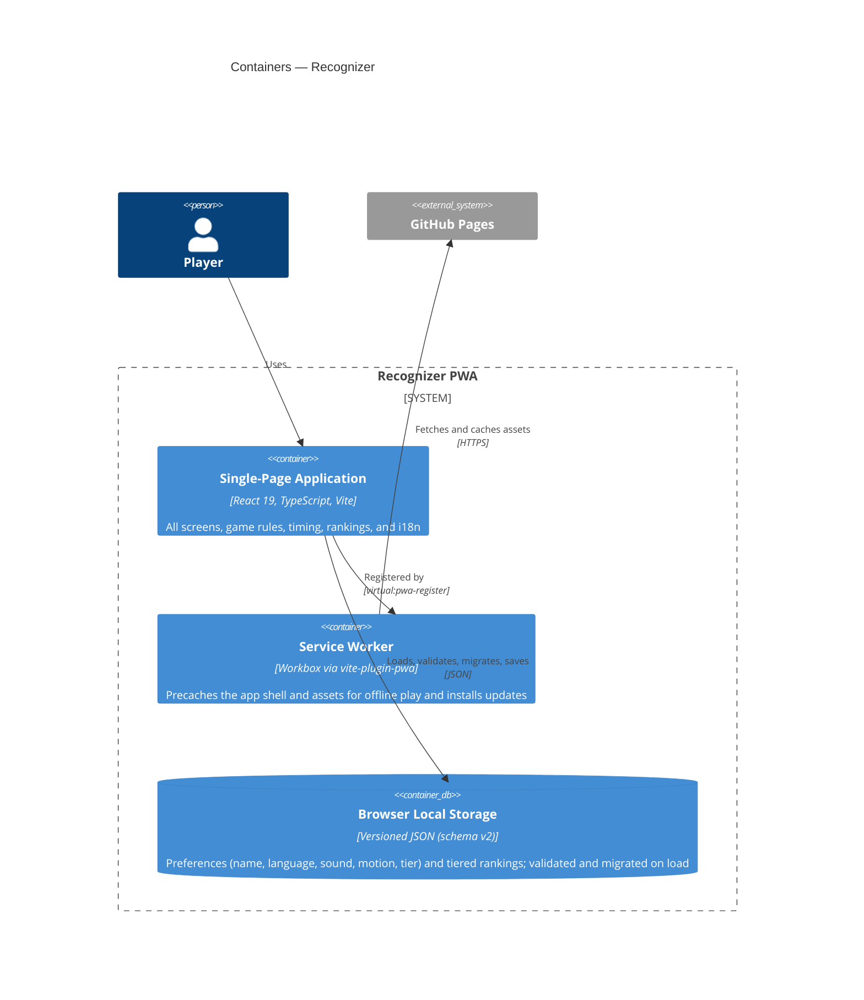
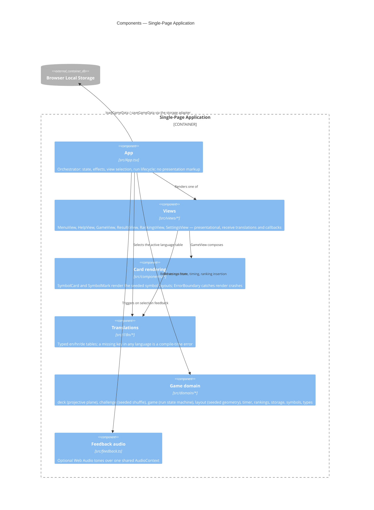
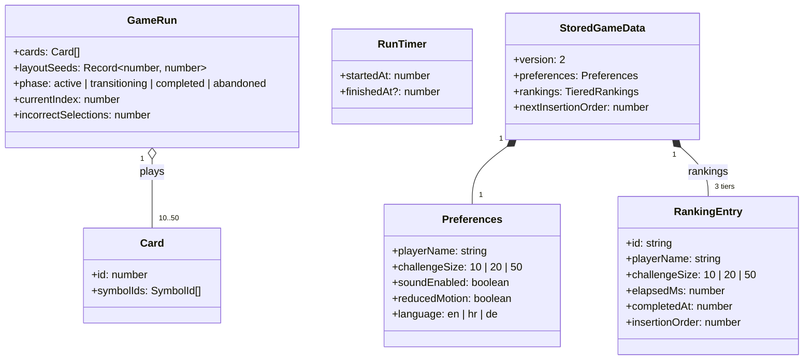
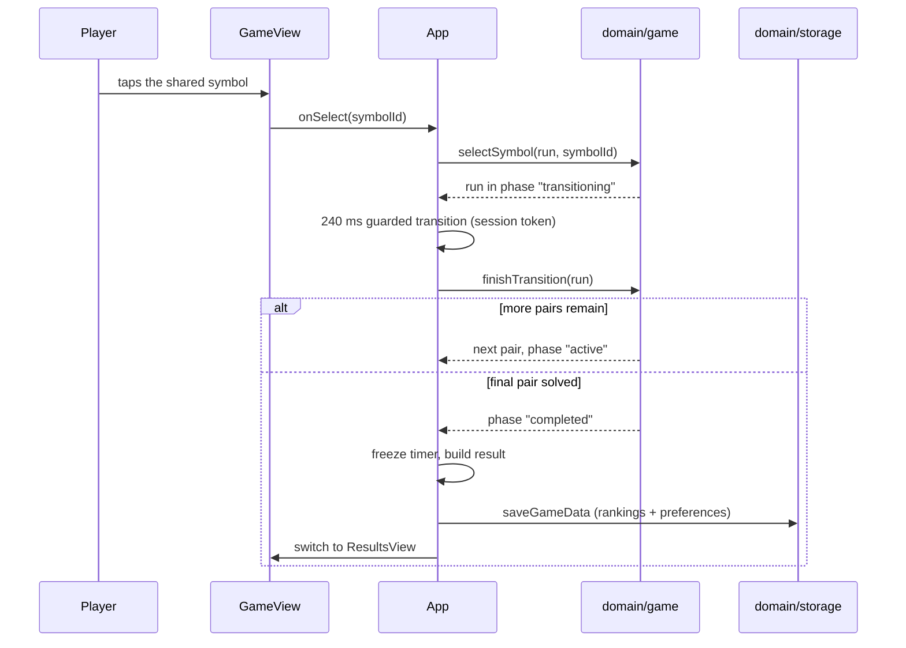
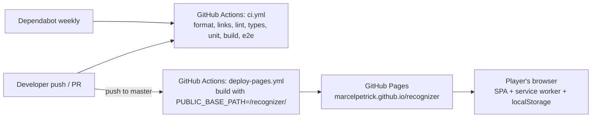

# C4 Architecture — Recognizer

Architecture documentation following the [C4 model](https://c4model.com): system context, containers, components, and code, plus a runtime and a deployment view. Kept in sync with the source; when structure changes, update this document in the same change set.

## Level 1 — System context

Recognizer is a fully client-side progressive web app. There is no backend: all game logic, persistence, and rankings live in the player's browser.

## Level 2 — Containers

## Level 3 — Components (inside the SPA)

The core rule: everything in `src/domain/` is framework-free TypeScript with injected randomness and time, so the game rules are fully unit-testable without React.

## Level 4 — Code (domain model)

Notes:

- The deck is generated from the finite projective plane of order 7 (`src/domain/deck.ts`): 57 cards, 8 symbols each, every pair of cards shares exactly one symbol. Tests assert every invariant over all card pairs.
- `RunTimer` values come from the monotonic `performance.now()`; only `RankingEntry.completedAt` is a wall-clock date.
- `storage.ts` validates untrusted JSON at the boundary and repairs or migrates old payloads (v1 → v2 added `language`) instead of discarding rankings.

## Runtime view — one correct selection

The complete game state machine (menu, preparing, active, transitioning, completed, abandoned) is diagrammed in [REVIEW_AND_WORKFLOW.md](./REVIEW_AND_WORKFLOW.md).

## Deployment view

